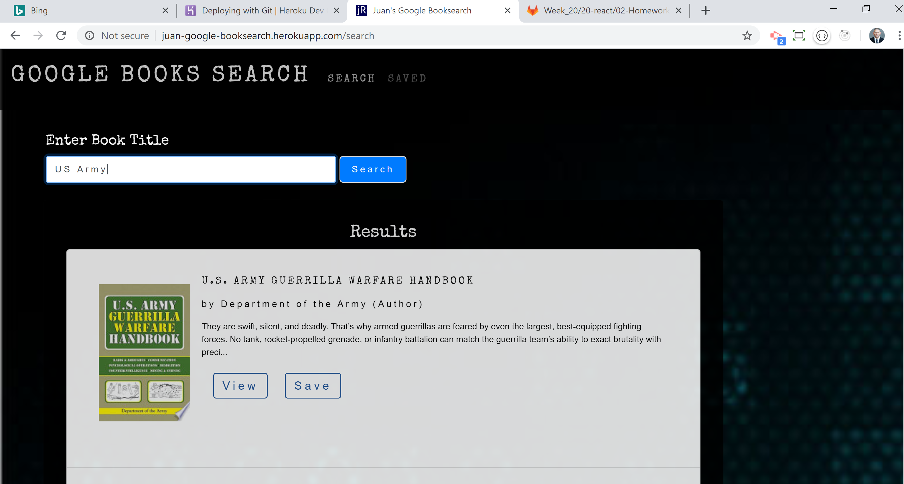

# Google Books Search 
- ```Developer: Juan Rivera```
- ```Date: February 26, 2020```

 

## Overview
**Google Books Search**  is a ```React```-based Google Books Search application.

## App Features
* ```Search``` This page allows the User to search for books via the Google Books API.  The searched book titles are rendered to the client where the User has the option to "View" a book, bringing them to the Google Books page, or "Saving" a book, which saves to the app's database.

* ```Saved``` This page renders all books saved to the Mongo database. User has an option to "View" the book, bringing them to the book on Google Books, or "Delete" a book, removing it from the app's database.


## Technical Details
* This is a full stack ```MERN``` application
* React ```Toastify``` was used for notifications
* One model was used for the ```Mongo``` Database 
* Google Books API was used 
 

## Try it live!
*The app has been deployed via Heroku*
* https://juan-google-booksearch.herokuapp.com/search
